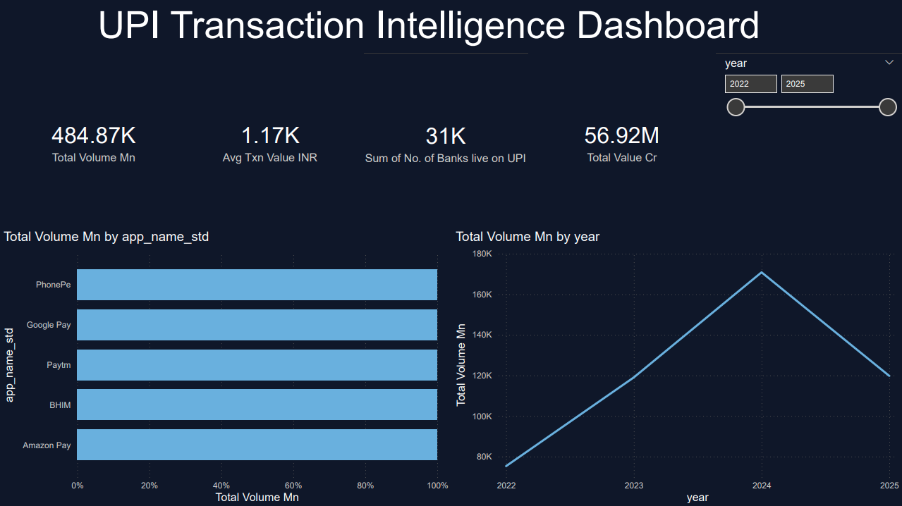
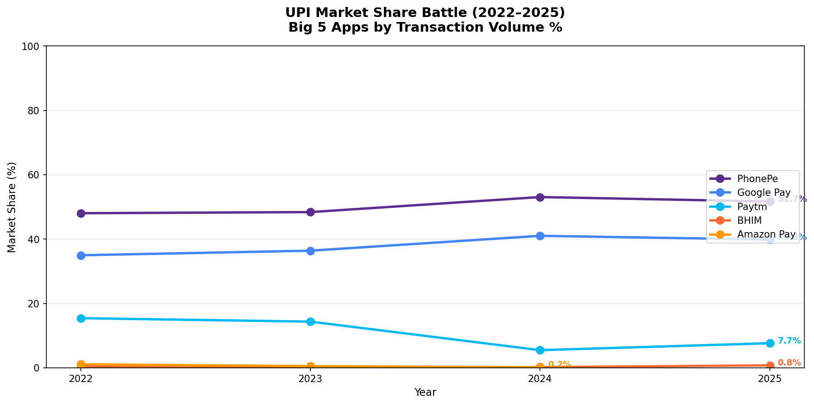
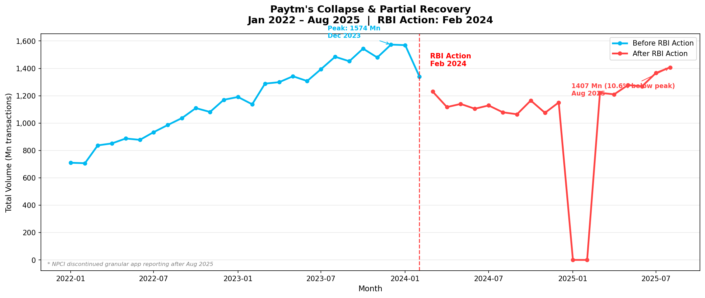
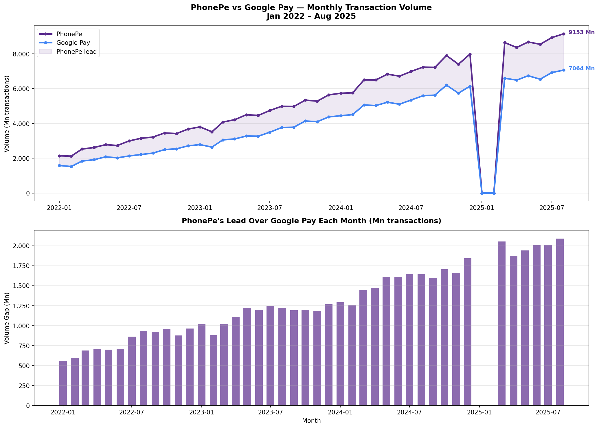
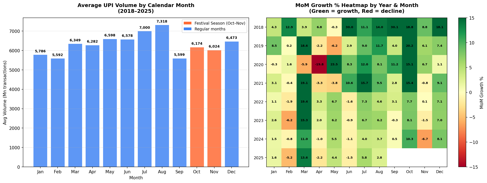
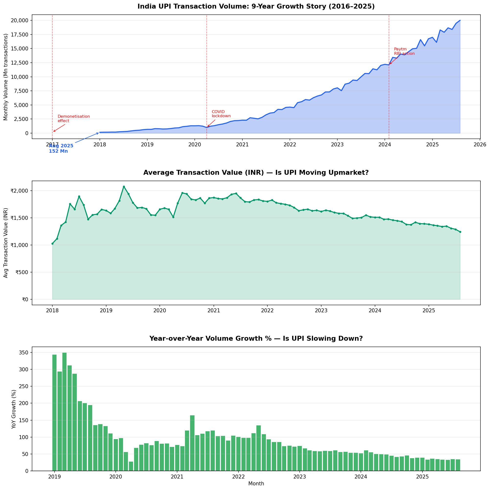
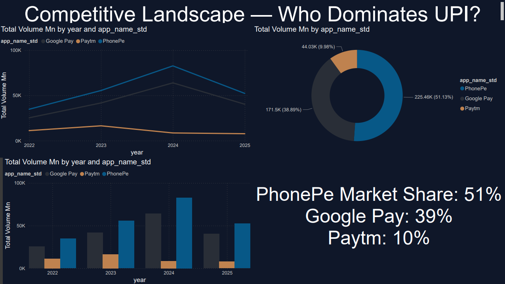
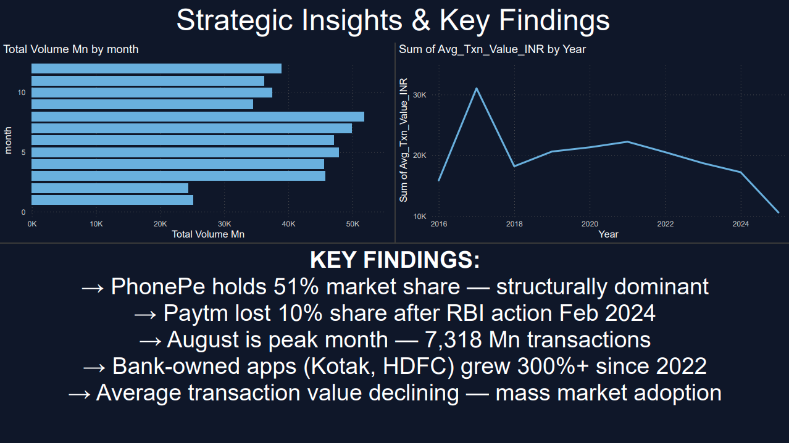

# UPI Transaction Intelligence Dashboard
### Analysing India's Real-Time Payment Ecosystem (2022–2025)



## Project Overview
End-to-end data analytics project analysing 48 months of real NPCI UPI transaction data.
Answers the question: **"If you're a fintech company deciding where to invest in 2025 — where does the data point?"**

**Data Source:** Official NPCI UPI Ecosystem Statistics (npci.org.in)
**Tools:** Python · SQL · Power BI · SQLite
**Data Period:** January 2022 – December 2025

---

## Key Findings

| Finding | Data Point |
|---|---|
| PhonePe market dominance | 51% share — held consistently for 4 years |
| Google Pay gaining ground | Grew from 35% to 39% (2022→2024) |
| Paytm collapse after RBI action | Peak 1,574 Mn (Dec 2023) → dropped 10.6% post Feb 2024 |
| August is peak month | 7,318 Mn avg transactions — highest of any month |
| Bank apps fastest growing | Kotak +373%, HDFC +331% (2022→2024) |
| UPI going mass market | Avg transaction value fell from ₹2,000 to ₹1,328 |
| 9-year growth | 152 Mn (2018) → 20,008 Mn (Aug 2025) — 132x growth |

---

## Project Structure
```
upi-intelligence/
├── data/
│   ├── raw/              ← 48 NPCI Excel files (not uploaded)
│   └── processed/        ← Clean CSVs
├── notebooks/
│   └── 01_npci_scraper.ipynb   ← Full pipeline
├── sql/
│   └── upi_business_queries.sql
├── reports/
│   ├── 01_market_share_battle.png
│   ├── 02_paytm_collapse_final.png
│   ├── 03_phonePe_vs_googlepay.png
│   ├── 04_seasonality.png
│   └── 05_upi_growth_story.png
└── README.md
```

---

## Analysis Charts

### 1. Market Share Battle (2022–2025)


### 2. Paytm Collapse After RBI Action


### 3. PhonePe vs Google Pay — Monthly Gap


### 4. Seasonality — Festival & FY-End Patterns


### 5. 9-Year UPI Growth Story


---

## Power BI Dashboard

3-page interactive dashboard:
- **Page 1:** UPI Growth Story — 9-year macro view
- **Page 2:** Competitive Landscape — PhonePe vs GPay vs Paytm
- **Page 3:** Strategic Insights — Seasonality + Key Findings




---

## SQL Analysis
10 business queries covering:
- Market size by year
- App-wise market share
- Paytm before vs after RBI action
- Fastest growing apps
- Transaction type mix (B2C vs B2B)
- Premium transaction apps

See: `sql/upi_business_queries.sql`

---

## How to Run
```bash
# Clone the repo
git clone https://github.com/mittulagarwal/upi-transaction-intelligence

# Install dependencies
pip install pandas numpy matplotlib seaborn openpyxl sqlalchemy jupyter

# Run the notebook
jupyter notebook notebooks/01_npci_scraper.ipynb
```

**Note:** Raw NPCI Excel files are not included due to size.
Download from: npci.org.in/what-we-do/upi/upi-ecosystem-statistics → UPI APPS tab

---

## Author
**Mittul Agarwal** — Data Analyst
- LinkedIn: linkedin.com/in/mittul-agarwal-254a12209
- GitHub: github.com/mittulagarwal
- Email: mittul2605@gmail.com